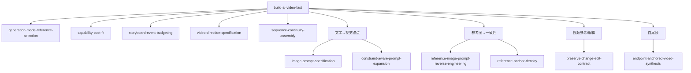

# AI Video Production Skill Index

## 推荐入口

| 你的目标 | 使用方式 |
| --- | --- |
| 从一句创意或已有素材完成 5–30 秒可制作短片 | [`build-ai-video-fast`](./build-ai-video-fast/SKILL.md) |
| 只解决一个明确的图片、参考、编辑、模型选择或镜头问题 | 选择下列对应原子 Skill |

`build-ai-video-fast` 选择一条主路线后，按需组合原子能力；它不替代局部任务的直接入口。

## 原子 Skill

### 视觉意图与参考

- [`image-prompt-specification`](./image-prompt-specification/SKILL.md)：将静态画面意图写成可控提示词。
- [`reference-image-prompt-reverse-engineering`](./reference-image-prompt-reverse-engineering/SKILL.md)：从可见证据反推相近视觉。
- [`constraint-aware-prompt-expansion`](./constraint-aware-prompt-expansion/SKILL.md)：在严格约束与创意探索之间扩写。
- [`reference-anchor-density`](./reference-anchor-density/SKILL.md)：为跨镜头身份、产品和场景配置足够锚点。

### 输入、编辑与成本

- [`generation-mode-reference-selection`](./generation-mode-reference-selection/SKILL.md)：为文字、图片、视频和音频分配控制职责。
- [`capability-cost-fit`](./capability-cost-fit/SKILL.md)：按失败风险规划小样与精修档位。
- [`preserve-change-edit-contract`](./preserve-change-edit-contract/SKILL.md)：明确局部编辑中的变更项与保留项。

### 视频规划与装配

- [`video-direction-specification`](./video-direction-specification/SKILL.md)：把情绪和故事转为可见动作、镜头和节奏。
- [`storyboard-event-budgeting`](./storyboard-event-budgeting/SKILL.md)：把脚本、事件数和时长转为分镜预算。
- [`endpoint-anchored-video-synthesis`](./endpoint-anchored-video-synthesis/SKILL.md)：锁定首尾帧、关键状态和循环落点。
- [`sequence-continuity-assembly`](./sequence-continuity-assembly/SKILL.md)：用动作、空间、接缝与节拍装配多镜头。

## 总工作流的组合关系

需要持续阅读课程方法、原始验证边界或旧版构建记录时，参见 [COURSE_OVERVIEW.md](./COURSE_OVERVIEW.md) 与 [verified.md](./verified.md)。