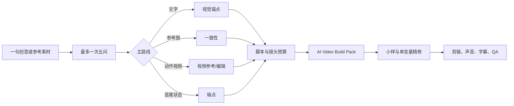

# AI Video Production Skill

`build-ai-video-fast` 是本仓库的首要入口：把一句创意或参考素材，规划为可直接交给外部生成与剪辑工具执行的单一 Markdown `AI Video Build Pack`。

它服务于个人创作者的 5–30 秒 AI 广告、剧情短片、产品片和社交视频。v0.2.0 保持平台中立：不绑定模型、不调用付费生成、不声称已生成成片，也不记录易过期的价格、积分或按钮路径。

## 从这里开始

完整项目请先使用 [`build-ai-video-fast`](./build-ai-video-fast/SKILL.md)。它会：

1. 仅补问尚未提供的五类关键信息，最多一次五问。
2. 在文字、参考图、动作视频和首尾帧四条路线中选择唯一主路线。
3. 复用最少必要的原子 Skill 形成脚本、分镜、提示词、锚点、迭代、声音、字幕、导出与 QA 计划。
4. 交付一份 [AI Video Build Pack 模板](./build-ai-video-fast/assets/AI-Video-Build-Pack-template.md) 结构的单一 Markdown 文件。

默认值：社媒/剧情/创作者广告为 15 秒、9:16、4 镜；产品宣传/功能展示为 20 秒、16:9、5 镜。通用建议交付为 1080p、30fps、H.264/AAC，但本仓库只完成制作规划，不实际导出。

## 何时直接使用原子 Skill

不要让完整工作流吞掉单点任务：

| 任务 | 直接入口 |
| --- | --- |
| 只写/优化静态图片提示词 | [`image-prompt-specification`](./image-prompt-specification/SKILL.md) |
| 分析一张参考图并反推相近视觉 | [`reference-image-prompt-reverse-engineering`](./reference-image-prompt-reverse-engineering/SKILL.md) |
| 在已有图片/视频上只改一处，其余必须不变 | [`preserve-change-edit-contract`](./preserve-change-edit-contract/SKILL.md) |
| 只比较生成档位、质量、速度与预算 | [`capability-cost-fit`](./capability-cost-fit/SKILL.md) |
| 只写单个镜头的动作、运镜或节奏 | [`video-direction-specification`](./video-direction-specification/SKILL.md) |

完整的原子 Skill 清单、组合关系和学习路径见 [INDEX.md](./INDEX.md)。

## 验证与范围

- 原有 11 个原子 Skill 共有 66 条回归用例。
- `build-ai-video-fast` 另有 12 条路线、边界与范围用例：[`test-prompts.json`](./build-ai-video-fast/test-prompts.json)。
- 六条独立端到端盲测场景见 [`validation/e2e-blind-test-cases.md`](./validation/e2e-blind-test-cases.md)。
- 可验证的结构、范围和结果记录见 [verified.md](./verified.md)。

本仓库仅发布原创的工作流、模板、测试与说明，不含课程视频、音频、转写、课件、截图或第三方媒体素材。真人、客户素材、商标、受版权保护角色和商业成片仍需由责任方确认授权、隐私、品牌与平台要求。详见 [NOTICE.md](./NOTICE.md)。

## License

仓库原创文本、结构、模板和测试采用 [MIT License](./LICENSE)。该许可证不覆盖原课程或任何第三方素材。